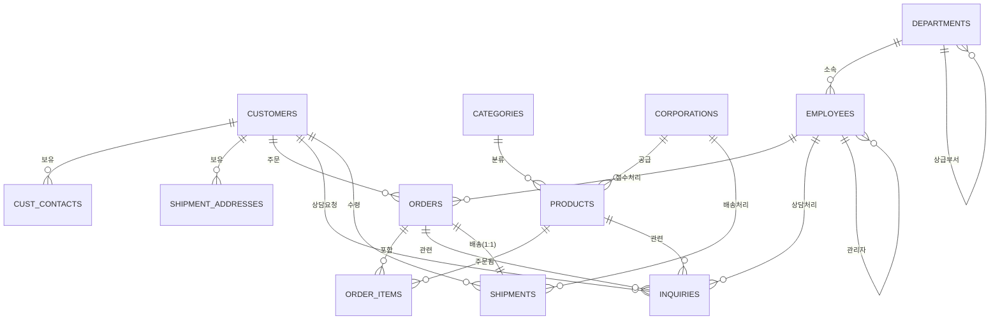

# BO 스키마 ERD 통합 문서

## 문서 개요
- **대상 스키마**: `BO` (Oracle)
- **작성 방식**: 도메인별 설계 문서 5종(고객/주문/상품/배송/문의 영역) + Oracle 딕셔너리 조회 결과(`USER_COL_COMMENTS`, `USER_TAB_COMMENTS`, `USER_CONSTRAINTS`, `USER_CONS_COLUMNS`, `USER_TAB_COLUMNS`, `USER_IND_COLUMNS`)를 교차 검증하여 통합
- **검증일**: 2026-07-09
- **검증 결과 요약**: 제공된 5개 도메인 문서의 컬럼 목록, 타입, NULL 여부, PK/FK, 코멘트는 실제 DB 메타데이터와 전량 일치. 다만 아래 "검증 중 발견 사항"의 보완이 필요.

---

## 검증 중 발견 사항

1. **사원/부서 영역 누락** — `ORDERS.ORDER_RCT_EMP_ID`, `INQUIRIES.EMP_ID`가 `EMPLOYEES`를 참조하는데, 기존 5개 문서에는 `EMPLOYEES`/`DEPARTMENTS` 도메인이 없어 ERD가 끊긴 상태였음. 본 문서에 **6번째 영역(사원/부서영역)** 으로 추가함.
2. **PK 제약조건명 오탈자 추정** — `CORPORATIONS` 테이블의 PK 제약조건명이 `CORPORATIONS_PK`가 아닌 **`COOPERATIONS_PK`** 로 등록되어 있음. 기능상 문제는 없으나 명명 규칙(`<TABLE>_PK`)에서 벗어난 유일한 사례이므로 참고용으로 기록.
3. **코드값 목록 미확인 컬럼**
   - `SHIPMENT_ADDRESSES.REGION_TYPE` (기존 Open Issue 유지)
   - `EMPLOYEES.JOB_POSITION` — 코멘트가 "직급"으로만 등록되어 있고 코드 매핑이 없음 (신규 발견)
4. **ERD 대상 제외 테이블** — `BO_TEST`, `PERF_STAT`, `PERF_STAT_P`, `TBL_IDX01`은 테이블 코멘트가 없고 업무 테이블과 FK 관계도 없어 테스트/성능검증용 스크래치 테이블로 판단, 본 ERD 대상에서 제외함.
5. **SHIPMENTS는 ORDERS와 1:1 관계** — `SHIPMENTS`의 PK가 `ORDER_ID` 단일 컬럼이므로 주문 1건당 배송 레코드가 정확히 1건만 존재하는 구조. 또한 `SHIPMENTS`는 `CUST_ID`를 `ORDERS`를 거치지 않고 직접 FK로 보유(비정규화) — 조회 성능을 위한 의도적 설계로 판단됨 (`SHIPMENTS_F2`, `IX_SHIPMENTS_R1` 인덱스가 이를 뒷받침).

---

## 전체 테이블 목록

| 영역 | 테이블명 | 테이블 설명 | PK |
|---|---|---|---|
| 고객 | CUSTOMERS | 고객 | CUST_ID |
| 고객 | CUST_CONTACTS | 고객연락처 | CUST_ID, CONTACT_TYPE, CONTACT_ORD_NUM |
| 고객 | SHIPMENT_ADDRESSES | 배송주소 | CUST_ID, SHIP_ADDR_ORD_NUM |
| 주문 | ORDERS | 주문 | ORDER_ID |
| 주문 | ORDER_ITEMS | 주문내역 | ORDER_ID, ORDER_SEQ_ID |
| 상품 | PRODUCTS | 상품 | PRODUCT_ID |
| 상품 | CATEGORIES | 상품분류 | CATEGORY_ID |
| 상품 | CORPORATIONS | 협력업체 | CORPORATION_ID |
| 배송 | SHIPMENTS | 배송내역 | ORDER_ID |
| 문의 | INQUIRIES | 상담내역 | CUST_ID, INQ_DT, INQ_TYPE |
| 사원/부서 *(신규)* | EMPLOYEES | 사원 | EMP_ID |
| 사원/부서 *(신규)* | DEPARTMENTS | 부서 | DEPT_ID |

> 제외 테이블(업무 무관): `BO_TEST`, `PERF_STAT`, `PERF_STAT_P`, `TBL_IDX01`

---

## 전체 ERD (Mermaid)

---

## 1. 고객영역

구성 테이블: `CUSTOMERS`, `CUST_CONTACTS`, `SHIPMENT_ADDRESSES`

### CUSTOMERS (고객)
- **PK**: CUST_ID / **FK**: 없음

| 컬럼명 | 타입 | NULL여부 | PK | FK | 설명 |
|---|---|---|---|---|---|
| CUST_ID | NUMBER | NOT NULL | PK |  | 고객ID |
| CUST_NAME | VARCHAR2(40) | NULL |  |  | 고객이름 |
| CUST_GENDER_TYPE | VARCHAR2(1) | NULL |  |  | 고객성별(1:남성,2:여성) |
| LOGIN_ID | VARCHAR2(10) | NULL |  |  | 로그인ID |
| LOGIN_PSWD | VARCHAR2(40) | NULL |  |  | 로그인비밀번호 |
| LOGIN_NAME | VARCHAR2(40) | NULL |  |  | 접속별명 |
| CUST_GRADE | VARCHAR2(1) | NULL |  |  | 고객등급 |

관계: CUST_CONTACTS(1:N), INQUIRIES(1:N), ORDERS(1:N), SHIPMENTS(1:N), SHIPMENT_ADDRESSES(1:N) 모두 CUST_ID로 참조받음.

### CUST_CONTACTS (고객연락처)
- **PK**: CUST_ID, CONTACT_TYPE, CONTACT_ORD_NUM / **FK**: CUST_ID → CUSTOMERS.CUST_ID (`CUST_CONTACTS_R1`)

| 컬럼명 | 타입 | NULL여부 | PK | FK | 설명 |
|---|---|---|---|---|---|
| CUST_ID | NUMBER | NOT NULL | PK | CUSTOMERS.CUST_ID | 고객ID |
| CONTACT_TYPE | VARCHAR2(1) | NOT NULL | PK |  | 연락처종류(1:전화,2:E-Mail) |
| CONTACT_ORD_NUM | NUMBER(2,0) | NOT NULL | PK |  | 연락처순번 |
| CONTACT_BASE_YN | VARCHAR2(1) | NULL |  |  | 연락처기본값여부 |
| CONTACT_REG_DT | DATE | NULL |  |  | 연락처등록일 |
| CONTACT_VALUE | VARCHAR2(60) | NULL |  |  | 연락처 |

### SHIPMENT_ADDRESSES (배송주소)
- **PK**: CUST_ID, SHIP_ADDR_ORD_NUM / **FK**: CUST_ID → CUSTOMERS.CUST_ID (`SHIPMENT_ADDRESS_R1`)

| 컬럼명 | 타입 | NULL여부 | PK | FK | 설명 |
|---|---|---|---|---|---|
| CUST_ID | NUMBER | NOT NULL | PK | CUSTOMERS.CUST_ID | 고객ID |
| SHIP_ADDR_ORD_NUM | NUMBER(2,0) | NOT NULL | PK |  | 배송지순번 |
| SHIP_ADDR_BASE_YN | VARCHAR2(1) | NULL |  |  | 배송지기본값여부 |
| SHIP_ADDR_REG_DT | DATE | NULL |  |  | 주소등록일 |
| REGION_TYPE | VARCHAR2(2) | NULL |  |  | 지역구분 |
| ZIPCODE | VARCHAR2(5) | NULL |  |  | 우편번호 |
| ADDRESS | VARCHAR2(400) | NULL |  |  | 주소 |

> **Open Issue**: `REGION_TYPE` 코드값 목록 미확인

---

## 2. 주문영역

구성 테이블: `ORDERS`, `ORDER_ITEMS`

### ORDERS (주문)
- **PK**: ORDER_ID / **FK**: CUST_ID → CUSTOMERS.CUST_ID (`ORDERS_R1`), ORDER_RCT_EMP_ID → EMPLOYEES.EMP_ID (`ORDERS_R2`)

| 컬럼명 | 타입 | NULL여부 | PK | FK | 설명 |
|---|---|---|---|---|---|
| ORDER_ID | NUMBER | NOT NULL | PK |  | 주문ID |
| CUST_ID | NUMBER | NULL |  | CUSTOMERS.CUST_ID | 고객ID |
| ORDER_DT | DATE | NULL |  |  | 주문일시 |
| ORDER_CHANNEL_TYPE | VARCHAR2(1) | NULL |  |  | 주문채널(1:홈페이지,2:모바일,3:전화) |
| ORDER_STATUS | VARCHAR2(1) | NULL |  |  | 주문상태(1:결제완료,2:상품준비중,3:상품발송,4:배송완료,8:주문취소,9:반품) |
| ORDER_RCT_EMP_ID | NUMBER | NULL |  | EMPLOYEES.EMP_ID | 주문접수자 |

인덱스: `ORDERS_F1`(CUST_ID), `ORDERS_F2`(ORDER_RCT_EMP_ID), `ORDERS_N1`(ORDER_DT), `ORDERS_N2`(ORDER_STATUS), `ORDERS_T1`(CUST_ID, ORDER_DT)

### ORDER_ITEMS (주문내역)
- **PK**: ORDER_ID, ORDER_SEQ_ID / **FK**: ORDER_ID → ORDERS.ORDER_ID (`ORDER_ITEMS_R1`), PRODUCT_ID → PRODUCTS.PRODUCT_ID (`ORDER_ITEMS_R2`)

| 컬럼명 | 타입 | NULL여부 | PK | FK | 설명 |
|---|---|---|---|---|---|
| ORDER_ID | NUMBER | NOT NULL | PK | ORDERS.ORDER_ID | 주문ID |
| ORDER_SEQ_ID | NUMBER(2,0) | NOT NULL | PK |  | 주문항목ID |
| PRODUCT_ID | NUMBER | NOT NULL |  | PRODUCTS.PRODUCT_ID | 상품ID |
| ORDER_QUANTITY | NUMBER(22,0) | NULL |  |  | 주문수량 |
| ORDER_PRICE | NUMBER | NULL |  |  | 주문가격 |

인덱스: `ORDER_ITEMS_F1`(PRODUCT_ID)

---

## 3. 상품영역

구성 테이블: `PRODUCTS`, `CATEGORIES`, `CORPORATIONS`

### PRODUCTS (상품)
- **PK**: PRODUCT_ID / **FK**: CATEGORY_ID → CATEGORIES.CATEGORY_ID (`PRODUCTS_R1`), VENDOR_ID → CORPORATIONS.CORPORATION_ID (`PRODUCTS_R2`)

| 컬럼명 | 타입 | NULL여부 | PK | FK | 설명 |
|---|---|---|---|---|---|
| PRODUCT_ID | NUMBER | NOT NULL | PK |  | 상품ID |
| CATEGORY_ID | NUMBER | NULL |  | CATEGORIES.CATEGORY_ID | 카테고리ID |
| VENDOR_ID | NUMBER | NULL |  | CORPORATIONS.CORPORATION_ID | 협력업체ID |
| PRODUCT_NAME | VARCHAR2(60) | NOT NULL |  |  | 상품이름 |
| ISBN_NO | VARCHAR2(40) | NULL |  |  | 국제표준도서번호 |
| PRODUCT_PRICE | NUMBER(22,0) | NULL |  |  | 상품가격 |
| WRITER_NAME | VARCHAR2(40) | NULL |  |  | 저자이름 |

인덱스: `PRODUCTS_F1`(CATEGORY_ID), `PRODUCTS_F2`(VENDOR_ID)

### CATEGORIES (상품분류)
- **PK**: CATEGORY_ID / **FK**: 없음

| 컬럼명 | 타입 | NULL여부 | PK | FK | 설명 |
|---|---|---|---|---|---|
| CATEGORY_ID | NUMBER | NOT NULL | PK |  | 카테고리ID |
| CATEGORY_NAME | VARCHAR2(60) | NULL |  |  | 카테고리 이름 |

### CORPORATIONS (협력업체)
- **PK**: CORPORATION_ID (제약조건명: `COOPERATIONS_PK`, 오탈자 추정) / **FK**: 없음

| 컬럼명 | 타입 | NULL여부 | PK | FK | 설명 |
|---|---|---|---|---|---|
| CORPORATION_ID | NUMBER | NOT NULL | PK |  | 협력업체ID |
| CORPORATION_NAME | VARCHAR2(60) | NULL |  |  | 협력업체이름 |
| REP_PHONE_NUMBER | VARCHAR2(40) | NULL |  |  | 대표연락처 |
| CORPORATION_TYPE | VARCHAR2(1) | NULL |  |  | 협력업체구분(1:출판사,2:공급업체,3:배송업체) |

---

## 4. 배송영역

구성 테이블: `SHIPMENTS`

### SHIPMENTS (배송내역)
- **PK**: ORDER_ID / **FK**: CUST_ID → CUSTOMERS.CUST_ID (`SHIPMENTS_R1`), ORDER_ID → ORDERS.ORDER_ID (`SHIPMENTS_R2`), SHIPMENT_CORPORATION_ID → CORPORATIONS.CORPORATION_ID (`SHIPMENTS_R3`)

| 컬럼명 | 타입 | NULL여부 | PK | FK | 설명 |
|---|---|---|---|---|---|
| ORDER_ID | NUMBER | NOT NULL | PK | ORDERS.ORDER_ID | 주문ID |
| CUST_ID | NUMBER | NOT NULL |  | CUSTOMERS.CUST_ID | 고객ID |
| SHIP_ADDR_ORD_NUM | NUMBER(2,0) | NOT NULL |  |  | 배송지순번 |
| SHIPMENT_STATUS | VARCHAR2(1) | NULL |  |  | 배송상태(1:배송전,2:배송중,3:배송완료,4:반품접수,5:반품완료) |
| SHIPMENT_CORPORATION_ID | NUMBER | NULL |  | CORPORATIONS.CORPORATION_ID | 협력업체ID |
| TRACKING_NUMBER | VARCHAR2(40) | NULL |  |  | 송장번호 |
| DELIVERY_START_DT | DATE | NULL |  |  | 배송시작일 |
| DELIVERY_END_DT | DATE | NULL |  |  | 배송완료일 |

인덱스: `IX_SHIPMENTS_R1`(CUST_ID, SHIP_ADDR_ORD_NUM), `SHIPMENTS_F1`(SHIPMENT_CORPORATION_ID), `SHIPMENTS_F2`(CUST_ID)

> **참고**: PK가 `ORDER_ID` 단일 컬럼이므로 주문:배송은 1:1 관계.

---

## 5. 문의영역

구성 테이블: `INQUIRIES`

### INQUIRIES (상담내역)
- **PK**: CUST_ID, INQ_DT, INQ_TYPE / **FK**: CUST_ID → CUSTOMERS.CUST_ID (`INQUIRIES_R1`), ORDER_ID → ORDERS.ORDER_ID (`INQUIRIES_R2`), PRODUCT_ID → PRODUCTS.PRODUCT_ID (`INQUIRIES_R3`), EMP_ID → EMPLOYEES.EMP_ID (`INQUIRIES_R4`)

| 컬럼명 | 타입 | NULL여부 | PK | FK | 설명 |
|---|---|---|---|---|---|
| CUST_ID | NUMBER | NOT NULL | PK | CUSTOMERS.CUST_ID | 고객ID |
| INQ_DT | DATE | NOT NULL | PK |  | 상담일시 |
| ORDER_ID | NUMBER | NULL |  | ORDERS.ORDER_ID | 주문ID |
| EMP_ID | NUMBER | NOT NULL |  | EMPLOYEES.EMP_ID | 사원ID |
| PRODUCT_ID | NUMBER | NULL |  | PRODUCTS.PRODUCT_ID | 상품ID |
| INQ_TYPE | VARCHAR2(1) | NOT NULL | PK |  | 상담구분(1:상품,2:배송,3:서비스,4:기타) |
| INQ_STATUS | VARCHAR2(1) | NULL |  |  | 상담처리상태(1:답변대기중,2:답변완료) |
| INQ_Q | CLOB | NULL |  |  | 상담내용 |
| INQ_A | CLOB | NULL |  |  | 답변내용 |
| INQ_SATIS_GRADE | VARCHAR2(1) | NULL |  |  | 상담만족도(1~5:5점척도) |

인덱스: `INQUIRIES_F1`(ORDER_ID), `INQUIRIES_F2`(EMP_ID), `INQUIRIES_F3`(PRODUCT_ID), `INQUIRIES_F4`(CUST_ID)

---

## 6. 사원/부서영역 *(신규 추가 — DB 메타데이터 기반)*

구성 테이블: `EMPLOYEES`, `DEPARTMENTS`

기존 5개 도메인 문서에는 없었으나, `ORDERS.ORDER_RCT_EMP_ID`와 `INQUIRIES.EMP_ID`가 `EMPLOYEES`를 참조하므로 ERD 완결성을 위해 추가함.

### EMPLOYEES (사원)
- **PK**: EMP_ID / **FK**: DEPT_ID → DEPARTMENTS.DEPT_ID (`EMPLOYEES_R1`), ADMIN_EMP_ID → EMPLOYEES.EMP_ID (`EMPLOYEES_R2`, 자기참조)

| 컬럼명 | 타입 | NULL여부 | PK | FK | 설명 |
|---|---|---|---|---|---|
| EMP_ID | NUMBER | NOT NULL | PK |  | 사원ID |
| EMP_NAME | VARCHAR2(20) | NOT NULL |  |  | 사원이름 |
| DEPT_ID | NUMBER | NULL |  | DEPARTMENTS.DEPT_ID | 부서ID |
| ADMIN_EMP_ID | NUMBER | NULL |  | EMPLOYEES.EMP_ID | 관리자ID |
| HIRE_DATE | DATE | NULL |  |  | 입사일자 |
| JOB_POSITION | VARCHAR2(1) | NULL |  |  | 직급 |
| SALARY | NUMBER(22,0) | NULL |  |  | 급여 |

인덱스: `EMPLOYEES_F1`(DEPT_ID), `EMPLOYEES_F2`(ADMIN_EMP_ID)

관계: → ORDERS(N:1, ORDER_RCT_EMP_ID), → INQUIRIES(N:1, EMP_ID)

> **Open Issue**: `JOB_POSITION` 코드값 목록 미확인

### DEPARTMENTS (부서)
- **PK**: DEPT_ID / **FK**: UPPER_DEPT_ID → DEPARTMENTS.DEPT_ID (`DEPARTMENTS_R1`, 자기참조)

| 컬럼명 | 타입 | NULL여부 | PK | FK | 설명 |
|---|---|---|---|---|---|
| DEPT_ID | NUMBER | NOT NULL | PK |  | 부서ID |
| DEPT_NAME | VARCHAR2(60) | NULL |  |  | 부서이름 |
| UPPER_DEPT_ID | NUMBER | NULL |  | DEPARTMENTS.DEPT_ID | 상급부서ID |

인덱스: `DEPARTMENTS_F1`(UPPER_DEPT_ID), `DEPARTMENTS_N1`(DEPT_NAME)

관계: ← EMPLOYEES(1:N, DEPT_ID)

---

## 전체 FK 관계 요약표

| Child Table | Child Column | FK명 | Parent Table | Parent Column |
|---|---|---|---|---|
| CUST_CONTACTS | CUST_ID | CUST_CONTACTS_R1 | CUSTOMERS | CUST_ID |
| SHIPMENT_ADDRESSES | CUST_ID | SHIPMENT_ADDRESS_R1 | CUSTOMERS | CUST_ID |
| ORDERS | CUST_ID | ORDERS_R1 | CUSTOMERS | CUST_ID |
| ORDERS | ORDER_RCT_EMP_ID | ORDERS_R2 | EMPLOYEES | EMP_ID |
| ORDER_ITEMS | ORDER_ID | ORDER_ITEMS_R1 | ORDERS | ORDER_ID |
| ORDER_ITEMS | PRODUCT_ID | ORDER_ITEMS_R2 | PRODUCTS | PRODUCT_ID |
| PRODUCTS | CATEGORY_ID | PRODUCTS_R1 | CATEGORIES | CATEGORY_ID |
| PRODUCTS | VENDOR_ID | PRODUCTS_R2 | CORPORATIONS | CORPORATION_ID |
| SHIPMENTS | CUST_ID | SHIPMENTS_R1 | CUSTOMERS | CUST_ID |
| SHIPMENTS | ORDER_ID | SHIPMENTS_R2 | ORDERS | ORDER_ID |
| SHIPMENTS | SHIPMENT_CORPORATION_ID | SHIPMENTS_R3 | CORPORATIONS | CORPORATION_ID |
| INQUIRIES | CUST_ID | INQUIRIES_R1 | CUSTOMERS | CUST_ID |
| INQUIRIES | ORDER_ID | INQUIRIES_R2 | ORDERS | ORDER_ID |
| INQUIRIES | PRODUCT_ID | INQUIRIES_R3 | PRODUCTS | PRODUCT_ID |
| INQUIRIES | EMP_ID | INQUIRIES_R4 | EMPLOYEES | EMP_ID |
| EMPLOYEES | DEPT_ID | EMPLOYEES_R1 | DEPARTMENTS | DEPT_ID |
| EMPLOYEES | ADMIN_EMP_ID | EMPLOYEES_R2 | EMPLOYEES | EMP_ID |
| DEPARTMENTS | UPPER_DEPT_ID | DEPARTMENTS_R1 | DEPARTMENTS | DEPT_ID |

---

## Open Issue 종합

- `SHIPMENT_ADDRESSES.REGION_TYPE` 코드값 목록 미확인
- `EMPLOYEES.JOB_POSITION` 코드값 목록 미확인 (신규 발견)
- `CORPORATIONS` PK 제약조건명이 `COOPERATIONS_PK`로 등록되어 있음 (명명 규칙 예외, 참고용)
- 전 테이블 공통: 실제 데이터 캡처 및 NULL 가능 컬럼 실측 확인 미완료
